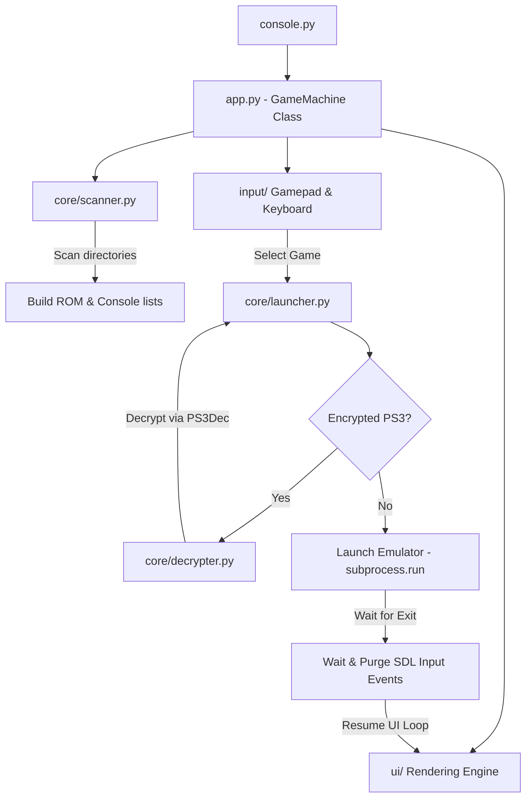

# 🎮 Game Machine

[](https://www.python.org/)
[](https://www.pygame.org/)
[](https://microsoft.com/windows)
[](https://github.com/)

An elegant, low-latency, gamepad-driven custom emulator frontend designed for retro gaming consoles. Game Machine consolidates emulation configurations, ROM directories, saves, and assets into a single, fully-portable workspace directory structure. Turn any Windows PC into a dedicated console interface.

---

## 📖 Table of Contents
1. [Core Features](#-core-features)
2. [Supported Consoles](#-supported-consoles)
3. [Architecture & Execution Flow](#-architecture--execution-flow)
4. [File System Directory Layout](#-file-system-directory-layout)
5. [Smart Features](#-smart-features)
6. [Getting Started & Installation](#-getting-started--installation)
7. [Adding a New Console](#-adding-a-new-console)
8. [Troubleshooting & FAQs](#-troubleshooting--faqs)
9. [Roadmap](#-roadmap)

---

## ✨ Core Features

*   **Console-style Fullscreen UI**: Designed from the ground up to feel like a PlayStation dashboard or Steam Deck UI. Runs borderless fullscreen, navigated entirely by gamepads (D-pads, joysticks, A/B/X/Y).
*   **Fully Portable Architecture**: All emulator configurations, BIOS files, savedata, shaders, and playtime records are self-contained. Copy `Game Machine` to an external drive, plug it into any PC, and run instantly.
*   **Background Cover Art Generator**: A background thread automatically extracts high-resolution 3:4 covers directly from PSP and PS3 ISO files (composited from internal `ICON0.PNG` and `PIC1.PNG`), and downloads PS2 cover art from remote repositories using game serial IDs.
*   **Automatic PS3 ISO Decryption**: Detects encrypted PS3 ISOs and guides the user through automatic headless decryption using `PS3Dec` before launching the game smoothly.
*   **Smart Game Name Cleaning**: Uses regex processing to sanitize ugly ROM filenames (e.g. removing region tags, release numbers, bracket prefixes) into human-readable titles.
*   **Playtime & Recent Games Tracker**: Automatically keeps track of your game sessions, total playtime, and last played timestamp in a local `playtime.json` database.
*   **Windows Startup/Auto-Start**: Easily registers to Windows Startup Registry as a background GUI shell, enabling direct boot into the console layout on PC start.

---

## 🎮 Supported Consoles

| Console | Emulator | Game Format | Launch Arguments | Auto-Start/Focus Flags |
| :--- | :--- | :--- | :--- | :--- |
| **Sony PSP** | PPSSPP (64-bit) | `.iso`, `.cso` | `--fullscreen` | Direct game boot |
| **Sony PS2** | PCSX2 (v2+) | `.iso`, `.chd` | `-fullscreen`, `-batch` | Auto-exits on game shut down |
| **Sony PS3** | RPCS3 | `.iso`, folders | `--no-gui` | Skips emulator UI straight to game |

*Support for auto-detected consoles: Any directory pair named `<CONSOLE_NAME>_win` and `<CONSOLE_NAME>_ios` is scanned dynamically, matching default formats (`.iso`, `.cso`, `.chd`, `.bin`).*

---

## 🏗️ Architecture & Execution Flow

Game Machine implements a decoupled architecture separating UI, hardware input, background workers, and shell execution.



1.  **Ingestion & Directory Discovery**: Scans local directory structures to map emulator binary locations and matching ROM locations.
2.  **Layout Rendering**: Draws a responsive Pygame dashboard featuring navigation tabs, animated particles, details card, and grid systems.
3.  **Process Suspension & Isolation**: Suspending Pygame rendering when launching an emulator, delegating CPU runtime to the child process.
4.  **Stale Input Purging**: After emulator execution finishes, a thread-safe delay clears all accumulated gamepad and keyboard inputs before waking up the Pygame render thread to prevent double-boot bugs.

---

## 📂 File System Directory Layout

To maintain full portability, organize the Game Machine folder as follows:

```
D:\Game Machine\
├── console.py                    # Main launcher entry point script
├── app.py                        # App orchestrator & pygame framework manager
├── playtime.json                 # Persistent playtime database (ignored by Git)
├── core/                         # Core execution logic modules
│   ├── config.py                 # System configurations and folder paths
│   ├── scanner.py                # Disk ROM/Directory discovery routines
│   ├── launcher.py               # Emulator launch subprocess wrapper
│   ├── decrypter.py              # Headless PS3 decryption thread wrapper
│   ├── autostart.py              # Windows Registry startup helper
│   └── playdata.py               # Playtime loader and formatter
├── ui/                           # Render systems (header, grid, tabs, popup, etc.)
├── input/                        # Gamepad, keyboard, and mouse controllers
├── covers/                       # Local cached art covers folder
├── PPSSPP_win/                   # PPSSPP Emulator folder (configured in Portable Mode)
├── PPSSPP_ios/                   # PSP Game ROMs directory
├── PCSX2_win/                    # PCSX2 Emulator folder (containing 'portable' marker file)
├── PCSX2_ios/                    # PS2 Game ROMs directory
├── RPCS3_win/                    # RPCS3 Emulator folder
├── RPCS3_ios/                    # PS3 Game ROMs directory
└── PS_Firmwares/                 # Backup place for BIOS and PUPS files
```

---

## 🧠 Smart Features

### 1. Regex Name Cleaning
Automatically filters messy scene-release naming conventions to show neat game titles:
*   **Original File**: `0517 - Tekken - Dark Resurrection (USA) (En,Fr,De,Es,It).iso`
*   **Cleaned Display**: `Tekken - Dark Resurrection`
*   *Regex Pattern*: `^\d+\s*-\s*` filters prefix IDs; `[\(\[].*?[\)\]]` strips region/version tags.

### 2. Dual-Source Cover Generator
Runs as an asynchronous background worker thread to compile box art:
*   **PSP & PS3 ISO Extraction**: Parses internal ISO directories (`PSP_GAME` / `PS3_GAME`) to extract `ICON0.PNG` (game logo) and `PIC1.PNG` (backdrop picture). Scales, blends, and overlays them into a stylized 3:4 ratio cover.
*   **PS2 Cover Downloader**: Extracts the internal PS2 game serial from the ISO file header (e.g., `SLUS-20622`) and queries remote repositories to download matching cover art automatically.

### 3. Input Event Purging
Solves a critical SDL bug where game controllers buffer input events in the background while an emulator has focus. Game Machine halts processing, waits for the emulator exit, waits 500ms, and calls `pygame.event.clear()` to discard buffered "launch" buttons, preventing game boot loops.

### 4. Background Decryption
Includes a decrypter wrapper that fuzzy matches your PS3 game name against a directory of keys (e.g. inside `PS3QDD`), runs a headless instance of `PS3Dec.exe`, handles the decryption stream in real-time, replaces the encrypted ISO file automatically, and runs the game.

---

## 🚀 Getting Started & Installation

### Prerequisites
*   **OS**: Windows 10/11.
*   **Python**: Python 3.8+ installed (Make sure to tick **"Add Python to PATH"** during installation).
*   **Game controllers**: XInput (Xbox, DualShock, DualSense, Steam Deck) or DirectInput controller.

### Setup Instructions
1.  **Clone or Copy** the entire project directory to your computer (e.g. `D:\Game Machine`).
2.  Install dependencies using command prompt:
    ```bash
    pip install pygame
    ```
3.  Ensure your emulators are placed in their respective `_win` directories and games are in `_ios` directories.
4.  Run Game Machine:
    ```bash
    python console.py
    ```

---

## 🔧 Adding a New Console

To add support for a new emulation platform (e.g., Nintendo Wii/Dolphin or Dreamcast/Flycast):

1.  Place the emulator folder under the root name, e.g., `Dolphin_win/`.
2.  Place ROMs under the matching name, e.g., `Dolphin_ios/`.
3.  Open `core/config.py` and register the console in the `CONSOLES` dictionary:
    ```python
    "WII": {
        "rom_folder": os.path.join(BASE, "Dolphin_ios"),
        "extensions": [".iso", ".wbfs"],
        "emulator": os.path.join(BASE, "Dolphin_win", "Dolphin.exe"),
        "args": ["-f", "-e"],
    }
    ```
4.  Launch `console.py` — Game Machine will auto-detect the new category, scanned ROMs, and render a dedicated colored tab dynamically.

---

## 🛠️ Troubleshooting & FAQs

*   **No games are showing up in the UI**: Check your directories path configurations in `core/config.py`. Game directories must match the extensions list.
*   **PS2 Emulator requires BIOS**: Ensure your bios files are placed inside `PCSX2_win\bios\` and selected inside the PCSX2 settings.
*   **Gamepad buttons are not registering**: Make sure the gamepad is connected before running `console.py`. If it disconnects, restart the UI launcher to reinitialize pygame joystick detection.
*   **Game boots twice upon exit**: Make sure your `app.py` has the event queue clear fix active (`pygame.event.clear()`) inside `launch_game()`.

---

## 📈 Roadmap

*   [x] **Level 1**: Multi-console scanning, regex name cleaner, scrolling lists, custom console tags, and input freeze bug fix.
*   [x] **Level 2**: Dynamic cover generation (ISO extraction & PS2 cover fetching by serial).
*   [ ] **Level 3**: Custom audio system (UI sounds, background music), console-wide filter tabs, and "Recently Played" history view.
*   [ ] **Level 4**: Borderless fullscreen optimization, exit menu OS shutdown integration, and Linux Flatpak support.

---

*Happy Gaming!* 🕹️
