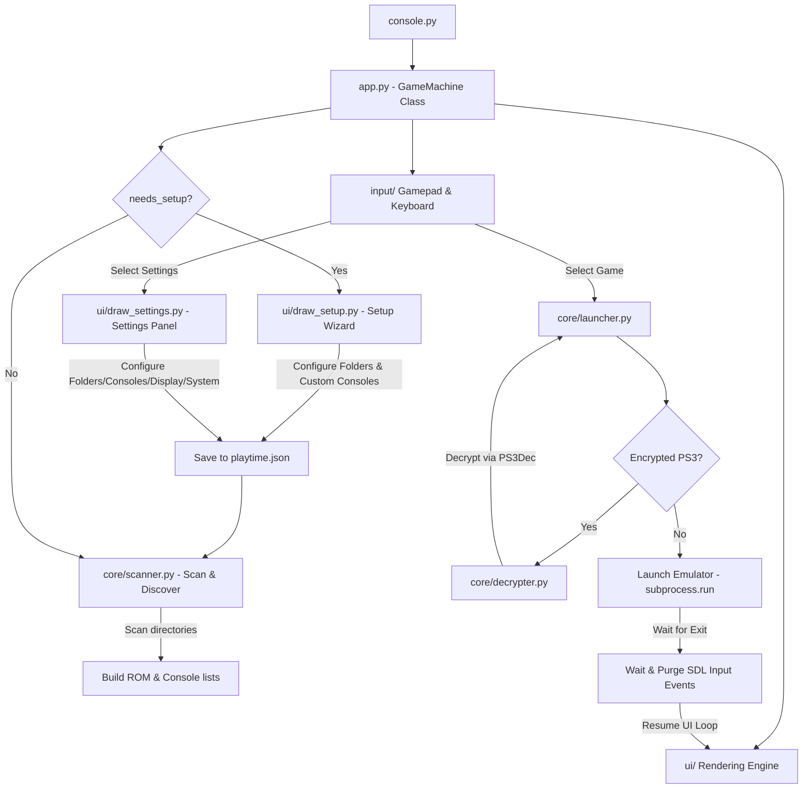

# 🎮 Game Machine

[](https://www.python.org/)
[](https://www.pygame.org/)
[](https://microsoft.com/windows)
[](https://github.com/)

An elegant, low-latency, gamepad-driven custom emulator frontend designed for retro gaming consoles. Game Machine consolidates emulation configurations, ROM directories, saves, and assets into a single, fully-portable workspace directory structure. Includes an interactive first-run Setup Wizard and a console-style Settings Panel to turn any Windows PC into a dedicated console interface.

---

## 📖 Table of Contents
1. [Core Features](#-core-features)
2. [Supported Consoles](#-supported-consoles)
3. [Architecture & Execution Flow](#-architecture--execution-flow)
4. [File System Directory Layout](#-file-system-directory-layout)
5. [Smart Features](#-smart-features)
6. [Getting Started & Installation](#-getting-started--installation)
7. [Adding a New Console](#-adding-a-new-console)
8. [Troubleshooting & FAQs](#-troubleshooting--faqs)
9. [Roadmap](#-roadmap)

---

## ✨ Core Features

*   **Console-style Fullscreen UI**: Designed from the ground up to feel like a console dashboard. Runs borderless fullscreen, navigated entirely by gamepads (D-pads, joysticks, A/B/X/Y) or keyboard.
*   **Interactive Setup Wizard**: Pygame-based setup wizard dynamically runs on first boot to specify library folders and register custom emulators using native Tkinter file and directory pickers.
*   **Unified Settings Panel**: A consolidated 5-tab settings modal (FOLDERS, CONSOLES, DISPLAY, SYSTEM, ABOUT) to manage game libraries, toggle fullscreen, customize grid size, configure auto-start, perform system actions (lock, shutdown, restart), and view statistics.
*   **Fully Portable Architecture**: All emulator configurations, BIOS files, savedata, shaders, and playtime records are self-contained. Copy `Game Machine` to an external drive, plug it into any PC, and run instantly. Playtimes and settings are stored in a local `playtime.json` database.
*   **Background Cover Art Generator**: A background thread automatically extracts high-resolution 3:4 covers directly from PSP and PS3 ISO files (composited from internal `ICON0.PNG` and `PIC1.PNG`), and downloads PS2 cover art from remote repositories using game serial IDs.
*   **Automatic PS3 ISO Decryption**: Detects encrypted PS3 ISOs and guides the user through automatic headless decryption using `PS3Dec` before launching the game smoothly.
*   **Smart Game Name Cleaning**: Uses regex processing to sanitize ugly ROM filenames (e.g. removing region tags, release numbers, bracket prefixes) into human-readable titles.
*   **Playtime & Recent Games Tracker**: Automatically keeps track of your game sessions, total playtime, and last played timestamp in a local `playtime.json` database, and synchronizes/merges playtime records across libraries.
*   **Windows Startup/Auto-Start**: Easily registers to Windows Startup Registry as a background GUI shell, enabling direct boot into the console layout on PC start.

---

## 🎮 Supported Consoles

| Console | Emulator | Game Format | Launch Arguments | Auto-Start/Focus Flags | Configuration Method |
| :--- | :--- | :--- | :--- | :--- | :--- |
| **Sony PSP** | PPSSPP (64-bit) | `.iso`, `.cso` | `--fullscreen` | Direct game boot | Auto-scanned or manual |
| **Sony PS2** | PCSX2 (v2+) | `.iso`, `.chd` | `-fullscreen`, `-batch` | Auto-exits on game shut down | Auto-scanned or manual |
| **Sony PS3** | RPCS3 | `.iso`, folders | `--no-gui` | Skips emulator UI straight to game | Auto-scanned or manual |
| **Custom** | Any emulator | User-defined | User-defined | Configurable via launcher | Wizard / Settings Panel |

*Support for auto-detected consoles: Any directory pair named `<CONSOLE_NAME>_win` and `<CONSOLE_NAME>_ios` residing in configured library folders is scanned dynamically, matching default formats (`.iso`, `.cso`, `.chd`, `.bin`).*

---

## 🏗️ Architecture & Execution Flow

Game Machine implements a decoupled architecture separating UI, hardware input, background workers, and shell execution.



1.  **Initialization & Setup Wizard**: Checks if primary library paths are configured; if not, launches the Setup Wizard to establish paths and scan behaviors.
2.  **Ingestion & Directory Discovery**: Scans local directory structures to map emulator binary locations and matching ROM locations across all configured library folders.
3.  **Layout Rendering**: Draws a responsive Pygame dashboard featuring navigation tabs, animated particles, details card, and grid systems.
4.  **Process Suspension & Isolation**: Suspends Pygame rendering when launching an emulator, delegating CPU runtime to the child process.
5.  **Stale Input Purging**: After emulator execution finishes, a thread-safe delay clears all accumulated gamepad and keyboard inputs before waking up the Pygame render thread to prevent double-boot bugs.

---

## 📂 File System Directory Layout

To maintain full portability, organize the Game Machine folder as follows:

```
D:\Game Machine\
├── console.py                    # Main launcher entry point script
├── app.py                        # App orchestrator & pygame framework manager
├── playtime.json                 # Persistent playtime database & configuration (ignored by Git)
├── core/                         # Core execution logic modules
│   ├── config.py                 # System configurations and path resolution
│   ├── scanner.py                # Disk ROM/Directory discovery routines
│   ├── launcher.py               # Emulator launch subprocess wrapper
│   ├── decrypter.py              # Headless PS3 decryption thread wrapper
│   ├── autostart.py              # Windows Registry startup helper
│   └── playdata.py               # Playtime database manager and formatter
├── ui/                           # Render systems (header, grid, tabs, popup, settings, setup, etc.)
│   ├── draw_setup.py             # First-run Setup Wizard UI
│   ├── draw_settings.py          # Unified Settings Panel modal
│   └── ...                       # Other UI rendering files
├── input/                        # Gamepad, keyboard, and mouse controllers
├── PPSSPP_win/                   # PPSSPP Emulator folder (configured in Portable Mode)
├── PPSSPP_ios/                   # PSP Game ROMs directory
├── PCSX2_win/                    # PCSX2 Emulator folder (containing 'portable' marker file)
├── PCSX2_ios/                    # PS2 Game ROMs directory
├── RPCS3_win/                    # RPCS3 Emulator folder
├── RPCS3_ios/                    # PS3 Game ROMs directory
└── PS_Firmwares/                 # Backup place for BIOS and PUPS files
```

*Note: The covers cache directory is resolved dynamically as `covers/` next to the primary library folder, allowing covers to persist alongside your game libraries.*

---

## 🧠 Smart Features

### 1. Regex Name Cleaning
Automatically filters messy scene-release naming conventions to show neat game titles:
*   **Original File**: `0517 - Tekken - Dark Resurrection (USA) (En,Fr,De,Es,It).iso`
*   **Cleaned Display**: `Tekken - Dark Resurrection`
*   *Regex Pattern*: Applies bracket regex filters recursively to cleanly handle nested tag structures (e.g. `Game (USA (En,Fr,De))`).

### 2. Dual-Source Cover Generator
Runs as an asynchronous background worker thread to compile box art:
*   **PSP & PS3 ISO Extraction**: Parses internal ISO directories (`PSP_GAME` / `PS3_GAME`) to extract `ICON0.PNG` (game logo) and `PIC1.PNG` (backdrop picture). Scales, blends, and overlays them into a stylized 3:4 ratio cover.
*   **PS2 Cover Downloader**: Extracts the internal PS2 game serial from the ISO file header (e.g., `SLUS-20622`) and queries remote repositories to download matching cover art automatically.
*   **Custom Console Mapping**: Automatically maps custom console names (like `Dolphin`) to PSP/PS2/PS3 cover art download and extraction routines by checking their emulator executable path.

### 3. Input Event Purging
Solves a critical SDL bug where game controllers buffer input events in the background while an emulator has focus. Game Machine halts processing, waits for the emulator exit, waits 500ms, and calls `pygame.event.clear()` to discard buffered "launch" buttons, preventing game boot loops.

### 4. Background Decryption
Includes a decrypter wrapper that fuzzy matches your PS3 game name against a directory of keys (e.g. inside `PS3QDD`), runs a headless instance of `PS3Dec.exe`, handles the decryption stream in real-time, replaces the encrypted ISO file automatically, and runs the game.

### 5. Unified Settings Panel
Provides a 5-tab system configurations modal directly inside the Pygame interface:
*   **FOLDERS**: Configure library folders to scan for games and emulator packages.
*   **CONSOLES**: View detected standard consoles and add/remove custom emulator definitions.
*   **DISPLAY**: Customize Grid Size (Small, Medium, Large) and toggle borderless Fullscreen.
*   **SYSTEM**: Setup Windows Auto-Start Registry integration, Lock Screen, Restart PC, Shutdown PC, or Exit.
*   **ABOUT**: View system-wide stats like game and console counts, directories, and version info.

---

## 🚀 Getting Started & Installation

### Prerequisites
*   **OS**: Windows 10/11.
*   **Python**: Python 3.8+ installed (Make sure to tick **"Add Python to PATH"** during installation).
*   **Game controllers**: XInput (Xbox, DualShock, DualSense, Steam Deck) or DirectInput controller.

### Setup Instructions
1.  **Clone or Copy** the entire project directory to your computer.
2.  Install dependencies using command prompt:
    ```bash
    pip install pygame
    ```
3.  Run Game Machine:
    ```bash
    python console.py
    ```
4.  **Complete the Setup Wizard**: On your first launch, the Setup Wizard will appear to help you map your primary library folders. It will auto-detect any standard emulators (`_win` / `_ios` pairs) in those folders.

---

## 🔧 Adding a New Console

To add support for a new emulation platform (e.g., Nintendo Wii/Dolphin or Dreamcast/Flycast):

### Option A: Portable Layout (Recommended)
Place the emulator and ROM folder side-by-side in any of your configured library folders:
*   **Emulator Folder**: `<CONSOLE_NAME>_win/` (e.g. `Dolphin_win/` containing `Dolphin.exe`)
*   **ROMs Folder**: `<CONSOLE_NAME>_ios/` (e.g. `Dolphin_ios/` containing `.iso`/`.wbfs` games)
Game Machine will automatically auto-discover the console and register it on the dashboard.

### Option B: Interactive Mapping
1.  Open the **Settings Panel** (SETTINGS button in the header) and navigate to the **CONSOLES** tab.
2.  Select **+ Add Custom Console**.
3.  Input the Console Name, select the emulator executable (`.exe`), select the ROM directory, and specify game extensions and custom launch arguments.
4.  Game Machine will automatically update `playtime.json`, rescan your files, and add the console to the dashboard list.

---

## 🛠️ Troubleshooting & FAQs

*   **No games are showing up in the UI**: Open **Settings -> FOLDERS** and verify that your library path is correct. Check **Settings -> CONSOLES** to ensure the emulator binary path and game extensions match your files.
*   **PS2 Emulator requires BIOS**: Ensure your bios files are placed inside `PCSX2_win\bios\` and selected inside the PCSX2 settings.
*   **Gamepad buttons are not registering**: Make sure the gamepad is connected before running `console.py`. If it disconnects, restart the UI launcher to reinitialize pygame joystick detection.
*   **Windows Auto-Start is not working**: Make sure you have enabled Auto-Start in the **Settings -> SYSTEM** tab. This registers the console startup script to the Windows Registry.

---

## 📈 Roadmap

*   [x] **Level 1 — Core Functionality**: Multi-console scanning, regex name cleaner, scrolling lists, custom console tags, and input freeze bug fix.
*   [x] **Level 2 — Box Art & Cover Grid**: Dynamic cover generation (ISO extraction & PS2 cover fetching by serial), cover image grid layout.
*   [x] **Level 3 — Console Feel & Assets**: Filter games by console tabs (using L1/R1 or Q/E to cycle), settings panel integration, database merges.
*   [x] **Level 4 — System-Level Console Mode**: Borderless fullscreen option, Windows Auto-Start registry integration, lock screen, shutdown/restart options in UI settings.
*   [ ] **WIP / Future Concepts**:
    *   UI sounds (select, confirm) and background music (BGM).
    *   Text search filter for quick ROM indexing.
    *   Cross-platform compatibility for Linux (using Flatpaks) to deploy on Steam Deck/other laptops.
    *   Multiple controller binding profiles.

---

*Happy Gaming!* 🕹️
